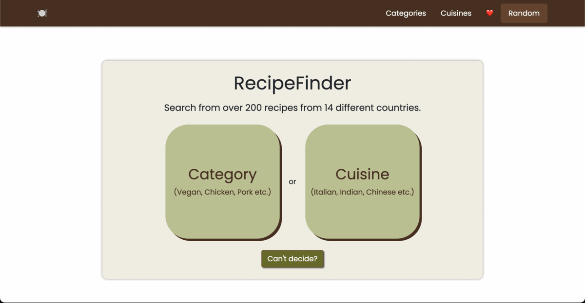
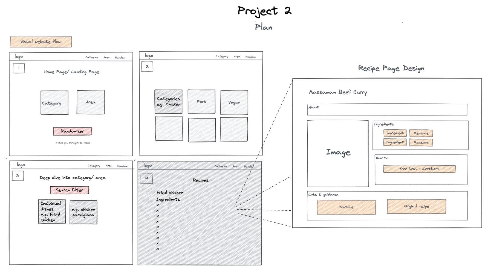

# Project 2: RecipeFinder

## Overview
This was the second project for the Software Engineering Immersive course with GA, which consisted of a hackathon over the course of a day and a half. I was paired with [jduligowski](https://github.com/jdkuligowski), and together we worked to plan, wireframe, and code the website before presenting it live over Zoom.

You can find the deployed version of our project [here](https://find-din-recipes.netlify.app/).



## Navigation

* [Brief](#the-brief)
* [Technologies Used](#technologies-used)
* [Approach](#approach)
* [Reflection](#reflection)
* [Future Features](#future-features)
* [Credits](#credits)

## The Brief

**Timeframe:**
* <36 hours

**General Project Brief:**
* Consume a public API – this could be anything but it must make sense for your project
* Have several components - At least one classical and one functional
* The app should include a router - with several “pages”
* Include wireframes - that you designed before building the app
* Be deployed online and accessible to the public

## Technologies Used
**Languages:**
* JavaScript (ES6+)
* React & React Router
* HTML5 & CSS3
* Sass
* Bootstrap
* Axios
* [The MealDB API](https://www.themealdb.com/api.php)

**Dev Tools:**
* VSCode
* Eslint
* Git & GitHub
* Insomnia

## Planning
We started this project out by first spending time picking a suitable API for this project. We were limited to free APIs and were also conscious of any APIs with strict rate limiting and tight limits-- this was only a two day project so we knew we would need to be making a lot of requests in a short time period. We found the MealDB API and, as a huge fan of cooking myself, this seemed like a perfect API to build a project around.

### Features
We used MoSCoW (Must-Have, Should-Have, Could-Have, and Won't-Have) as a base for planning the features for our project, and decided these were the main features we hoped to implement:
* Must-Have
  * Detailed recipe page
  * Cuisine and Category pages
  * Navbar
* Should-Have
  * Homepage
* Could-Have
  * Search bar
  * Random recipe button
  * Saving recipe favorites on local memory

### Wireframing

Next, we wireframed a general plan for how we wanted the site to look, and what the website flow would look like. We highlighted our "Could-Have" features in red.



## Coding

* We pair-coded the core features of the website (fetching data from the API, routing, etc.), but then worked separately on certain features to make sure we maximized the use of our time given the short time frame, such as dividing up the styling of different pages and working on certain features separately.
 * My partner worked to download images from the CountryFlags API that we could add to a folder to use on our "Cuisines" page, as The MealDB did not provide any images. My partner also worked to roll out the search feature across several pages for a consistent experience across both the Category and Cuisine pages.
 * On my end, I worked to implement the random buttons on both the homepage and the navbar, as well as the storage of favorites on local memory and ensuring sure the heart button on the recipe page was reflective of whether or not the recipe was already saved to favorites or not.

### Search Feature

The search filter on each page was implementing using a combination of useState and useEffect, where when the value of the text input box changed, we would update the filters state, then use this to create a filtered array.

Within this handleChange() function below, while we could have achieved the same result with simiply `setFilters(e.target.value)`, we set the state as an object to keep the door open for additional filtering options in the future:

```
// useState to store filtered array and filters
  const [filteredDishes, setFilteredDishes] = useState([])
  const [filters, setFilters] = useState({
    searchTerm: ''
  })
  
const handleChange = (e) => {
    const updatedObj = {
      ...filters,
      [e.target.name]: e.target.value
    }
    setFilters(updatedObj)
  }
```
Once we defined the filter state, we filtered the array we fetched from the API uisng RegExp, allowing us to only display recipes that meet the search term:

```
  useEffect(() => {
    if (category.length) {
      const regexSearch = new RegExp(filters.searchTerm, 'i')
      const filtered = category.filter(dish => {
        return regexSearch.test(dish.strMeal)
      })
      setFilteredDishes(filtered)
    }
  }, [filters, category])
  ```

#### Favorites Feature

Personally, one of the most challenging parts of this project for me was implementing the favorites feature. I didn't yet know that localStorage stored items as strings, so once I understood that concept, I was then able to create and manipulate a favorites array by parsing/stringifying it. Then, depending on whether or not the array existed, I was able to add/remove items from the array, elimiating the chances of duplicate favorites.

```
  // ! Adding a Favorite and Storing it on Local Memory
  const addFav = () => {
    let favArray = JSON.parse(window.localStorage.getItem('fav-recipes'))
    if (favArray === null) { // If favArray isn't stored in local storage under fav-recipes, create it and store the favorited recipe as the first item in the array
      favArray = [{...recipe}]
      window.localStorage.setItem('fav-recipes', JSON.stringify(favArray))
    } else { // If FavArray does exist on local storage:
      let favArrayString = favArray.map(value => JSON.stringify(value))
      if (favArrayString.indexOf(JSON.stringify(recipe)) === -1) { //  If current recipe DOESN'T exist in FavArray, add it
        favArrayString.push(JSON.stringify(recipe))
      } else { // If current recipe DOES exist in FavArray, remove it
        favArrayString.splice(favArrayString.indexOf(JSON.stringify(recipe)), 1)
      }
      favArray = favArrayString.map(value => JSON.parse(value)) 
      window.localStorage.setItem('fav-recipes', JSON.stringify(favArray)) //  
    }
    navigate('/favorites')
  }
```
The second part that stumped me with the favorites feature was then making sure the heart button on the recipe page reflected whether or not the recipe already existed in favorites. Originally I set the heart button in the above function, but realized that once I refreshed, the button no longer showed the right heart emoji. To tackle this, I used a useEffect that checked local memory for if the recipe existed or not, then set the button's emoji accordingly with a ternary.

```
// ! Checking Local Memory if Recipe Exists, then Updating Favorites Button Accordingly
useEffect(() => {
    const getFavStatus = () => {
      if (JSON.parse(window.localStorage.getItem('fav-recipes'))) { // Check if fav-recipes exists on local storage
        const favArrayString = JSON.parse(window.localStorage.getItem('fav-recipes')).map(value => JSON.stringify(value))
        favArrayString.indexOf(JSON.stringify(recipe)) !== -1 ? setFavMsg("💔") : setFavMsg("❤️")
      }
    }
    getFavStatus()
  }, [recipe])
```

## Reflection

### Challenges

Working within a very short time frame meant really prioritizing certain aspects over others, such as working to implement core features for the user over other aspects that aren't a top priority. For me, this was reducing time put towards styling, and instead spending more time on refining and de-bugging any features we had already added to make sure everything is in working order for our MVP and presentation.

### Key Learnings

For me, this project re-inforced the idea that while planning is /key/ with any project-- planning with the /user/ in mind is imperative. Because we were under a short deadline, a lot of the initial planning was around what key + stretch features we wanted to add and how things should be laid out, but I think one thing we may have glossed over was thinking about the user and what features would be the most valuable to their experience on our website. Simple things, like a back button on the recipe page, would have been a desireable features to have, but was missed in the initial planning.

## Future Features

If we had more time, we would have loved to incorporate additional features, like:
* Recipe search by ingredient - allowing users to filter for recipes given 1-5 ingredient inputs.
* Portion control - allow users to scale a recipe up or down (ex. halving/doubling the ingredients) with a +/- tick option
* Cuisine & Category filtering - if we had access to the whole list of recipes via the API, combining the cuisine and category pages into one grand page with differnt filtering/search options would give the user more search power on just one page

## Credits:

* API
  * [The MealDB](https://www.themealdb.com/)

* Images
  * Flags on "Cuisines" Page - [CountryFlags API](https://www.countryflagsapi.com/)
  * Favicon - [FlatIcon](https://www.flaticon.com/free-icon/book_1721455?term=recipe%20book&page=1&position=37&page=1&position=37&related_id=1721455&origin=search)

* Fonts
  * Poppins - [Google Fonts](https://fonts.google.com/specimen/Poppins)
